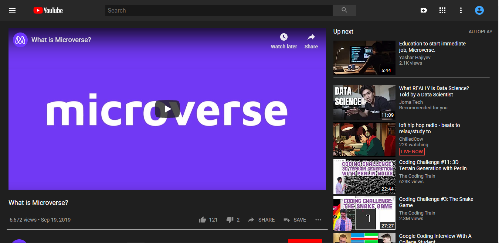

# Youtube Clone

> This is an assigment for Microverse HTML and CSS course. The goal is to clone the Youtube page with static functionability.

Additional description about the project and its features.

## Built With

- HTML,
- CSS,
- Visual Studio Code

## Live Demo

[Live Demo](https://kevinalvesdev.github.io/youtube-clone/)

## Getting Started

To get a local copy up and running follow these simple example steps.

### Prerequisites

- A compatible browser with HTML and CSS. 

### Install

- Just clone the project

### Usage

- Open the index.html file in any browser or edit using Visual Code or the preference IDE for web development

## Authors

👤 **Felipe Dacal Fragoso**

- Github: [@fdfragoso](https://github.com/fdfragoso)
- Twitter: [@fdfragoso](https://twitter.com/fdfragoso)
- Linkedin: [@fdfragoso](https://www.linkedin.com/in/fdfragoso/)

👤 **Kevin Alves**

- Github: [@kevinalvesdev](https://github.com/Kevinalvesdev)
- Twitter: [@kevinnnmn](https://twitter.com/kevinnnmn)
- Linkedin: [@kevinnn](https://www.linkedin.com/in/kevinnn/)

## 🤝 Contributing

Contributions, issues and feature requests are welcome!

Feel free to check the [issues page](https://github.com/Kevinalvesdev/youtube-clone/issues).

## Show your support

Give a ⭐️ if you like this project!

## Acknowledgments

- The Odin Project
- Youtube

## 📝 License

This project is free to use as learning purposes. For any external content (e.g. logo, images, ...), please contact the proper author and check their license of use.
